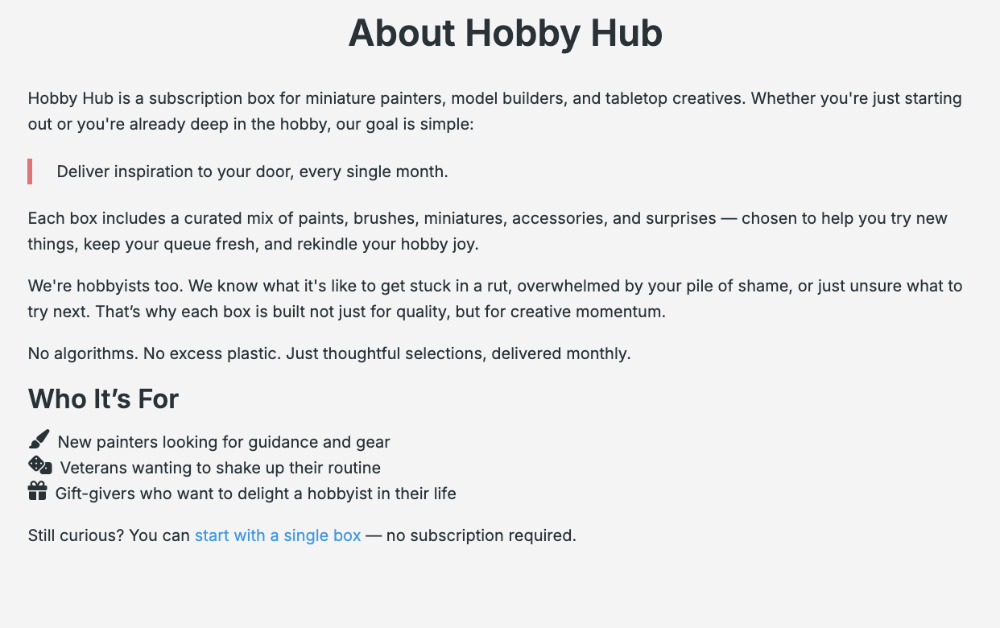
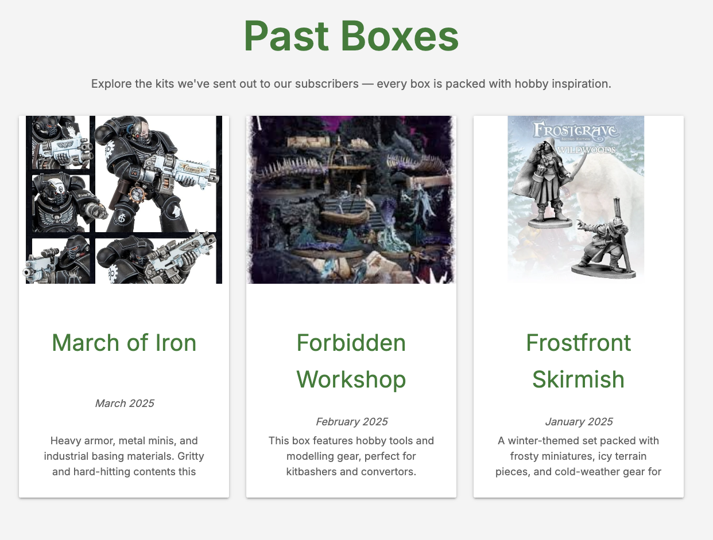
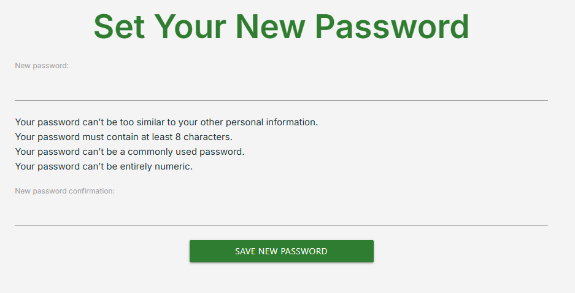
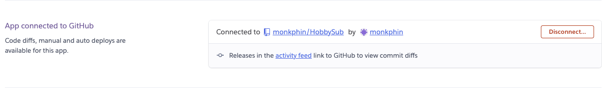

# Contents

[Site Concept](#site-concept)

  - [Site Owner Goals](#site-owner-goals)
  - [A Visitors Goals](#visitor-goals)

[User Stories](#user-stories)

[Scope](#scope) 

[Design](#design)

  - [Wireframes](#wireframes)
  - [Schema](#schema)
  - [UX](#ux)
  - [Colour Palette](#colour-palette)
  - [Typography](#typography)
  - [Images](#images)
  - [Icons](#icons)
  - [Features](#features)

[Future Features](#future-features)

[Security, Defensive Programming and Best Practices](#security-defensive-programming-and-best-practices)  

[Technology](#technology)
  - [Frameworks and Programs](#frameworks-and-programs)

[Testing and Validation](#testing-and-validation)

 [Version Control and Deployment](#version-control-and-deployment)

  - [Repository Creation](#repo-creation)
  - [Cloning Locally](#cloning-locally)
  - [Adding and Updating Files on the Repo](#adding-and-updating-files-on-the-repo) 
  - [Working on Multiple Devices](#working-on-multiple-devices)
  - [Local Deployment](#local-deployment)
  - [PostGres DB Creation](#postgres-db-creation)
  - [Heroku Setup and Configuration](#heroku-set-up-and-configuration)

[Acknowledgements](#acknowledgements)


# Site Concept
HobbySub is an online eCommerce site for tabletop wargame and model making hobbyists. It provides a mystery-box subscription service, which ships a new box of hobby supplies every month based on a specific theme. Subscriptions are available on a monthly, quarterly (3-month), biannual (6-month), or annual basis, with discounted pricing for longer commitments. Users can also purchase single boxes, if they're not yet ready to subscribe. The site has logic built into it to allow for purchases to be bought as items for the user, or as a gift to someone else, with personalised gift emails sent out when the item is ordered. 

To manage and prioritise tasks, I used a Kanban board to track project progress from inception to completion, alongside a MoSCoW board for structured planning and prioritisation. 

[My MoSCoW board can be found here](https://github.com/users/monkphin/projects/5/views/1)

[My Kanban board can be found here](https://github.com/users/monkphin/projects/6/views/1)

## Site Owner Goals

 - Provide a secure and scalable platform to sell and manage subscription-based box offerings.
 - Allow users to easily subscribe to recurring boxes or gift one-off boxes to others.
 - Enable users to manage their own subscriptions (pause, cancel, change address).
 - Maintain full control over box offerings, shipment schedules, and customer data.
 - Ensure clear separation between admin and regular user functionality for operational security.
 - Offer a professional, responsive, and accessible user interface across all devices.
 - Integrate Stripe to handle recurring billing and one-off payments.
 - Track and manage recurring orders and payments tied to active subscriptions.
 - Provide a reliable mechanism for scheduling box shipments based on renewal dates.
 - Deploy the platform on scalable, cloud-based infrastructure with minimal downtime.
 - Reduce support load through clear UI, meaningful feedback, and user-accessible history.

## Visitor Goals

 - Browse available subscription box options and view what types of products they typically include.
 - View detailed info about each months box: theme, contents summary, and shipping frequency options.
 - Easily subscribe to a box for themselves or send it as a gift to another address.
 - Register and log in to manage subscriptions, update shipping details, and view upcoming shipments.
 - Pause or cancel their subscription without needing to contact support.
 - View order history, upcoming delivery dates, and previous payments in one place.
 - Check payment method details and update card info securely if needed.
 - Receive confirmation emails for each successful order and payment.
 - Use a mobile-friendly, accessible site with support for keyboard navigation and screen readers.
 - Feel confident that their personal and payment information is handled securely.
 - Get help or support quickly if they run into issues with orders, addresses, or billing.


# User Stories

| **Category**                | **User Story**                                                                                      |
|----------------------------|------------------------------------------------------------------------------------------------------|
| Authentication & Permissions | As a user, I want to register and log in securely so I can access my account and manage my subscriptions. |
|                            | As a logged-in user, I want to view and update my profile details (like shipping address or email). |
|                            | As a logged-in user, I want to access only my own data, not see admin pages or other users' info. |
|                            | As an admin, I want to restrict access to admin features like box creation and order management. |
|----------------------------|------------------------------------------------------------------------------------------------------|
| Boxes & Subscription Browsing | As a user, I want to browse available subscription boxes so I can choose one that suits me or someone else. |
|                            | As a user, I want to have options for frequency of payment plans, including its price and shipping schedule. |
|                            | As an admin, I want to create, edit, and remove box offerings to control what's available. |
|----------------------------|------------------------------------------------------------------------------------------------------|
| Subscription Management    | As a user, I want to subscribe to a box for myself or gift it to someone else. |
|                            | As a user, I want to pause or cancel my subscription at any time. |
|                            | As a user, I want to choose or update the shipping address for each subscription. |
|                            | As a user, I want to see upcoming shipping dates for my subscription boxes. |
|----------------------------|------------------------------------------------------------------------------------------------------|
| Checkout & Payment         | As a user, I want to securely check out and save my payment details for recurring billing. |
|                            | As a user, I want to see confirmation of successful or failed payments. |
|                            | As a user, I want to update my payment method if my card changes. |
|----------------------------|------------------------------------------------------------------------------------------------------|
| Orders & Post-Purchase Flow | As a user, I want to see my order history so I can track previous deliveries. |
|                            | As a user, I want to view payment details associated with past orders (e.g., card type, last 4 digits). |
|                            | As a user, I want to receive confirmation emails for successful orders and renewals. |
|                            | As an admin, I want to view all orders, linked subscriptions, and user details for support or fulfillment. |
|----------------------------|------------------------------------------------------------------------------------------------------|
| UX and Accessibility       | As a user, I want the site to be easy to navigate, even on mobile, so I can find what I need quickly. |
|                            | As a user, I want clear feedback when I complete actions (e.g., subscribing, pausing, paying). |
|                            | As a user, I want the site to support screen readers and keyboard navigation for accessibility. |
|----------------------------|------------------------------------------------------------------------------------------------------|
| Admin & Configuration      | As an admin, I want to manage boxes, subscriptions, and orders via a secure dashboard. |


# Design Choices

The initial site design is intentionally minimal, leveraging Materialize for a clean, responsive layout. This choice was made to prioritise backend functionality and Stripe integration over heavy front-end customisation. By using Materialize's grid and component system, development time was optimised, allowing more focus on core application logic and data flow.

The backend implementation was designed with DRY (Don't Repeat Yourself) principles in mind. For example, single HTML templates are used for similar user flows, such as self-purchases and gift purchases, reducing redundancy and simplifying maintenance. This approach also extends to subscription management, order handling, and admin views, ensuring consistency across the site.

## [Wireframes](#wireframes)
Wireframes were created with Balsamiq and provided rough initial mockups for how the site should look. Some variation from these occurred as the project developed. 

<details>
<summary>Homepage</summary>
  
</details>
<br>

<details>
<summary>Subscription Page</summary>
  
</details>
<br>

<details>
<summary>Basket</summary>
  
</details>
<br>

<details>
<summary>Checkout</summary>
  
</details>
<br>

<details>
<summary>Past Boxes</summary>
  
</details>
<br>

<details>
<summary>Account Page</summary>
  
</details>
<br>


##  [Schema](#schema)
To enhance security and streamline data management, I chose to use Django’s built-in `User` model for authentication and user management. This approach eliminates the need for custom table design while benefiting from Django’s robust, battle-tested security features, including secure password hashing and session handling.

For payment processing, all sensitive billing information is handled exclusively by Stripe. No credit card data is stored on the site, which significantly reduces risk in the event of a data breach. While some personally identifiable information (PII) — such as names, email addresses, and shipping addresses — is stored for order fulfillment, all payment data remains securely isolated within Stripe’s infrastructure. This separation ensures that any potential breach would have minimal financial impact.

The full database schema can be viewed here:  
**https://erd.dbdesigner.net/designer/schema/1743344075-django-project**  
A screenshot is also included below for convenience. While the `User` table is not defined in my own models, it is provided by Django and included in the ERD to illustrate its relationships within the system.

<details>
<summary>ERD</summary>
  
</details>
<br>

### Database Model Overview

| Model                  | Purpose                                                                                                                                                                             | Key Fields                                                                                                                                                                                                                                       | Relationships                                                                                     |
|------------------------|-------------------------------------------------------------------------------------------------------------------------------------------------------------------------------------|--------------------------------------------------------------------------------------------------------------------------------------------------------------------------------------------------------------------------------------------------|----------------------------------------------------------------------------------------------------|
| **User**               | Stores all user accounts, including regular users and admin accounts.                                                                                                               | `user_id` (PK), `username`, `email`, `password`, `first_name`, `last_name`, `is_staff`, `is_superuser`, `date_joined`                                                                                    | One-to-many with ShippingAddress, StripeSubscriptionMeta, Order, Payment                         |
| **UserProfile**        | Stores Stripe customer ID for a user (used for customer lookup when creating payments).                                                                                             | `id` (PK), `user_id` (FK) → User, `stripe_customer_id`                                                                                                                                                    | One-to-one with User                                                                              |
| **ShippingAddress**    | Stores one or more delivery addresses per user. Used for personal or gifted boxes.                                                                                                  | `shipping_id` (PK), `user_id` (FK) → User, `recipient_f_name`, `recipient_l_name`, address fields, `postcode`, `country`, `is_default`, `is_gift_address`, `label`                                        | Many-to-one with User; One-to-many with Order and StripeSubscriptionMeta                         |
| **StripeSubscriptionMeta** | Links a Stripe-managed subscription to internal data. Captures shipping address and gift status.                                                                                    | `id` (PK), `user_id` (FK) → User, `stripe_subscription_id`, `stripe_price_id`, `shipping_address_id` (FK), `is_gift`, `created_at`, `cancelled_at`                                                       | Many-to-one with User and ShippingAddress; One-to-many with Order                                |
| **Box**                | Admin-created box offerings. Archived boxes stay viewable in history.                                                                                                               | `box_id` (PK), `name`, `slug`, `description`, `image_url`, `shipping_date`, `is_archived`, `created_at`                                                                                                   | One-to-many with Order and BoxProduct                                                            |
| **BoxProduct**         | Represents each item in a box. Used to display box contents in carousels or lists.                                                                                                  | `id` (PK), `box_id` (FK) → Box, `name`, `image_url`, `description`, `quantity`                                                                                                                             | Many-to-one with Box                                                                             |
| **Order**              | Represents a single box shipment. Created via Stripe webhook after successful charge.                                                                                               | `order_id` (PK), `user_id` (FK) → User, `shipping_address_id` (FK) → ShippingAddress, `box_id` (FK) → Box, `stripe_subscription_id`, `stripe_payment_intent_id`, `order_date`, `scheduled_shipping_date`, `status`, `is_gift` | Many-to-one with User, ShippingAddress, Box; One-to-many with Payment                           |
| **Payment**            | Logs each payment attempt or success. Created by webhook when Stripe charge occurs.                                                                                                 | `payment_id` (PK), `user_id` (FK) → User, `order_id` (FK) → Order, `payment_date`, `amount`, `status`, `payment_method`, `payment_intent_id`                                                              | Many-to-one with User and Order                                                                  |


When reading up on Django models, I encountered this, which seemed helpful since I had a few issues with getting tooltips to play nice on my last project. So this seems like it may help with this. https://docs.djangoproject.com/en/3.2/ref/models/fields/#help-text

##  [UX](#ux)
### UX Design and User Flow

When a user first visits the site, they land on the Home Page, which looks the same for both logged-in and logged-out users. However, navigation menus and buttons dynamically adjust based on the user's authentication status and role. For example, purchase and gift purchase buttons have two distinct versions:
 - Logged-out Users: These buttons guide users through a registration journey as part of the purchase flow, ensuring every buyer is registered and linked with a Stripe ID.
 - Logged-in Users: The flow skips registration and goes directly to the purchase stage, streamlining the checkout process.
This logic guarantees that all users are fully registered before making a purchase, enhancing order tracking and payment processing.

### Navigation and Menu Logic

Once logged in, users are presented with a tailored menu:
 - Account Page Access — View and manage orders, addresses, and subscription details.
 - Logout Button — A simple and accessible way to end the session.
 - Dynamic Purchase Buttons — Adjust to reflect that the user is authenticated.

## Page Overviews:

### About Page

The About page provides users with information about the service, including who might benefit from it, typical box contents, and a call to action for subscriptions or single-box purchases.

### Buy for Myself / Give as a Gift

Both menu items present similar options:
 - Users can select from single boxes or four subscription tiers (monthly, quarterly, biannual, annual).
 - Messaging and layout dynamically adjust to reflect whether the purchase is a gift or for personal use.

### Purchase Flow
The purchase flow is nearly identical for both personal and gift orders:
 - 1 Plan Selection: Users choose between a single box or one of four subscription plans.
 - 2 Address Picker: The user selects a shipping address. If none exist, they can add one at this stage, as well as edit or add new addresses.

 - 3 Gift Divergence:
 -- For personal orders, users proceed directly to Stripe for payment.
 -- For gift orders, the user is prompted to enter optional fields: sender's name, recipient's name, recipient's email, and a personalised message. All fields are optional, allowing for anonymous or surprise gifting if desired.

 - 4 Stripe Checkout: Users complete their purchase securely via Stripe. If they cancel, they are redirected to a page offering options to retry or return home. Successful purchases take users to a confirmation page with links to account details and order history.

### My Account Page
The My Account page grants users access to:
 - User Details and Order History — Quick access to past orders and account information.
 - Change Password — Requires the current password for validation.
 - Edit Account Information — Update email, username, and names.
 - Address Management — Add, edit, or remove personal and gift addresses.
 -- If only one personal address exists, it cannot be deleted while active orders or subscriptions are ongoing to prevent delivery issues.
 -- Friendly names (e.g., Home, Work) can be assigned for clarity.

# Order History Page
Orders are split into two categories: Subscriptions and Single Boxes.
 - Each item displays order number, status (Pending, Processing, Shipped, Cancelled), order date, recipient info (if a gift), estimated shipping date, and renewal date for subscriptions.
 - Users can view more detailed information or cancel subscriptions directly from this page.
 - A globally-located password-protected modal is used for destructive actions like cancellation to prevent accidental misuse.

### Admin Dashboard
If the user is an admin, an additional Admin Menu becomes available, offering access to:
 - Box Management — Add, edit, delete, or archive boxes.
 -- Archived automatically if past the current month.
 -- Cloudinary is used for image uploads, with images optional for early box creation.
 -- Orphaned products (those not assigned to a box) are listed and can be bulk-added to boxes.
 - Product Management — Add, remove, or orphan products within a box.
 -- Products can be edited or deleted, with password-protected modals to prevent accidental removal.
 -- User Management — View all registered users, their details, and subscription statuses.
 -- Admins can activate, deactivate, or reset passwords for users, as well as view their account in Stripe for billing support.
 - Order Management — Monitor order IDs, payment status, order state, and manage subscription cancellations.

### Security Features
Where destructive or sensitive actions occur (e.g., cancelling subscriptions, deleting products, changing sensitive user data), password-protected modals are used for defensive programming. Toast notifications are displayed for actions like updates or changes, providing clear feedback to the user.

Additionally, email notifications are triggered for key events:
 - Order Confirmation
 - Subscription Renewals
 - Account State Changes

Emails are currently plaintext, but provide necessary feedback for user assurance.


##  [Colour Palette](#colour-palette)
The color scheme was chosen late in development to create a welcoming and easy-on-the-eye experience. The primary colors are neutral and calming, with a focus on readability and accessibility.
 - Primary Color: Various shades of green are used throughout the site, particularly for navigation menus and headers, creating a consistent visual identity.
 - Button Colors:
 -- Green: Positive actions (e.g., submit, confirm)
 -- Red: Caution or destructive actions (e.g., delete, cancel)
 -- Blue: Neutral actions (e.g., edits, updates)
 -- Teal: Other buttons where Red, Green, or Blue may already be in or where an alternative colour felt fitting. 
 -- Grey: Simple actions like back buttons etc. 

This color-coding ensures that users can quickly understand the purpose of each button, enhancing usability and reducing the chance of errors.

By keeping the color scheme simple and purposeful, the site remains both functional and aesthetically pleasing.

##  [Typography](#typography)
Similar to the color palette, font choices were made later in development, with initial focus placed on core functionality. Two Google Fonts were selected to provide clear visual distinction between headings, body text, and navigation elements.
- Both fonts are clean, sans-serif, and optimised for readability across devices.
- They were also chosen with accessibility in mind, ensuring clarity for all users, including those in the neurodiverse community.

This careful selection supports readability and user comfort throughout the site experience.


##  [Images](#images)
Local images are kept to a minimum, with all primary visual assets hosted on Cloudinary. This approach reduces server load, improves site performance, and simplifies image management.
- Cloudinary handles image storage, optimisation, and delivery, ensuring fast load times.
- This also enables easy updates and versioning without the need for redeployment.
- Image URLs are securely referenced, reducing exposure to direct access vulnerabilities.

By leveraging Cloudinary, the site remains lightweight and efficient, even as image content scales.

##  [Icons](#icons)
Icons throughout the site are provided by Font Awesome, enhancing navigation and user interactions with clean, universally recognisable symbols.
- Icons are used for key features such as:
 -- Buttons (e.g., edit, delete, submit)
 -- Bullet Points for lists
 -- Navigation Links
- Font Awesome ensures consistency and scalability across all devices, maintaining a professional look while simplifying UI elements.

This choice keeps the interface intuitive and visually consistent, improving the user experience.

## [Features](#features#)
All pages have been designed with a mobile-first approach and are fully responsive across a wide range of devices and screen sizes. Most pages adapt fluidly when the browser is resized, maintaining layout integrity and usability.

Two exceptions — the Box Create/Edit and Product Create/Edit pages — exhibit a known issue where the layout compresses or visually distorts when the browser window is resized. This does not affect functionality and resolves on page refresh. The issue is documented in more detail in the testing section.

### Navbar

<details> 
<summary>Nav Bar</summary> 
     
</details> 
<br> 

<details> 
<summary>Side Nav</summary> 
     
</details> 
<br> 

The navbar is designed to be user-friendly and responsive across both desktop and mobile formats. On smaller screens, it condenses into a hamburger icon that triggers a slide-out side navigation menu when tapped. The navigation dynamically adjusts the visible options based on the user's login status — simplifying the interface for new visitors while providing quick access to relevant features for returning users and administrators.

- Site Name: Functions as a link back to the homepage.
- Responsive Navigation:
-- Desktop View:
--- A fixed top navbar shows key links.
--- Menu items vary based on login/admin status.
--- Options by State:
---- Not Logged In: Home, About, Past Boxes, Buy for Myself, Give as Gift, Register, Login.
---- Logged In: Home, About, Past Boxes, Buy for Myself, Give as Gift, My Account, Logout.
---- Admin: All logged-in links plus access to the admin dropdown menu.
-- Mobile View:
--- Compact header with a hamburger menu icon.
--- Tapping the icon opens a side-drawer navigation menu.
--- Admin and purchase options are grouped under labeled sections with visual dividers for clarity.

The 'Buy for Myself' and 'Give as a Gift' buttons are context-aware:
- If the user is not logged in, clicking either redirects them to the registration page and then into the purchase flow.

- If the user is logged in, the buttons skip registration and take them directly into the purchase journey.
This dynamic behaviour helps reduce friction for new users while streamlining the experience for returning customers.


### Global (DRY) Confirmation Modal

<details> 
<summary>Confirmation Modal</summary> 
     
</details> 
<br> 

The project uses a single globally available modal for all confirmation-based actions. This includes scenarios where sensitive operations (like deleting an item or cancelling a subscription) require user verification via password entry.

Why it matters:
- Reusable and DRY-compliant.
- Ensures secure interaction for destructive actions.
- Prevents accidental edits or deletions through a consistent interface.

### Global Error Handler

<details> 
<summary>Confirmation Modal</summary> 
     
</details> 
<br> 

A standardised global error handler is used for flashing form and system errors where appropriate (e.g. incorrect password, invalid form input). This keeps user feedback consistent and avoids cluttering templates with one-off error logic.

###Home Page

<details> 
<summary>Confirmation Modal</summary> 
     
     
     
</details> 
<br> 

The home page is likely the first page a user encounters, so it's designed to immediately convey the core purpose and offerings of the site. Two subscription boxes are always displayed:
- This Month’s Box – includes a carousel of the current box's contents, helping users visualise what they’ll receive.
- Next Month’s Box – shows the upcoming box's name and a theme image to build interest and encourage early subscriptions.

Fallback images are used if a box is missing its own image, ensuring the layout remains clean and functional even in edge cases.

Below the featured boxes, the homepage provides a simple, visual overview of how the service works, broken into three clear steps:
- Pick Your Plan
- We Ship
- You Enjoy
These reinforce the straightforward nature of the service.
Finally, two prominent call-to-action buttons are displayed:
- Pick a Plan
- Give as a Gift
Like the navigation bar, these buttons adapt based on the user’s login status:
- If the user is not logged in, the buttons redirect to registration before entering the purchase journey.
- If the user is logged in, they go straight into the appropriate flow.
This adaptive behaviour helps reduce friction for new users while maintaining quick access for returning customers.

### Login and Registration Pages

<details> 
<summary>Login and Registration</summary> 
     
     
     
</details> 
<br> 

These pages are designed to be straightforward and user-friendly, giving users the ability to either create a new account or sign in to an existing one.
Upon successful registration, users are sent a confirmation email. This step is required to verify ownership of the provided email address, as the platform handles e-commerce functionality. The confirmation link signs the user in automatically upon activation, minimising friction and helping them move straight into the experience without needing to log in again.
User authentication and account handling are managed entirely through Django’s built-in systems, meaning password security and validation rules follow Django’s default standards.
To support usability:
- The registration page includes a direct link to the login page, making it easy for returning users who may have ended up on the wrong screen.
- The login page includes a "Forgot Password" link that allows users to securely reset their password if needed.
- Toast messages are used to provide immediate feedback on actions (e.g., registration success, login errors).
- An interstitial confirmation page is displayed after registration, reminding users to check their inbox. This page also offers the option to resend the confirmation email in case it wasn’t received.

### About Page

<details> 
<summary>About Page</summary> 
     
</details> 
<br> 

The About page introduces the core philosophy and purpose behind Hobby Hub. It explains that the service is tailored for miniature painters, model builders, and tabletop enthusiasts — from complete beginners to seasoned hobbyists. The focus is on delivering inspiration and creativity through monthly curated boxes containing paints, brushes, miniatures, tools, and surprises designed to keep the hobby engaging and enjoyable.

The page emphasizes the project's community-driven ethos, noting that it’s built by hobbyists, for hobbyists; with an emphasis on thoughtful curation over algorithm-driven filler. It also outlines the intended audiences, including new painters, long-time veterans, and gift-givers.

The tone is warm, inviting, and hobby-focused, and the page includes a link encouraging new users to try a one-off box before committing to a subscription.

### Past Boxes Page

<details> 
<summary>Past Boxes</summary> 
     
</details> 
<br> 

The Past Boxes page allows both new and returning users to browse previous subscription boxes. Each box is displayed using a Materialize card layout, featuring the box name, theme image, shipping date, and a short description of the theme. This helps users understand the kind of content typically included in a subscription.

Each card also includes a clickable link that takes the user to a dedicated Past Box Contents page, where they can see exactly what was inside that specific box. This supports transparency and helps set expectations for future boxes.

### Past Boxes Contents Page

<details> 
<summary>Past Box Contents</summary> 
     
</details> 
<br> 

The Past Box Contents page shows users the individual items included in a previously shipped box. Each item is displayed in its own Materialize card, featuring an image and a brief description. This gives users a clear view of the quality and variety they can expect from the service and helps build confidence in the value of the subscription.

### Purchase Options (Buy for myself/Buy as a gift)

<details> 
<summary>Purchase Options</summary> 
     
</details> 
<br> 

The Purchase Options page is designed with DRY principles in mind, supporting both the 'Buy for Myself' and 'Give as Gift' flows using shared logic and templates.

Users are presented with a set of subscription choices displayed as Materialize cards. Each card outlines the key details of the plan — including billing frequency, total cost, and any savings associated with longer-term commitments. Users can choose between four subscription durations or a one-off box, making it easy to find an option that suits their needs or gift intentions.

The page adapts its messaging and actions to reflect the user's journey, ensuring a clear and consistent experience without duplicating code or components.

### Address Selector

<details> 
<summary>Address Selector</summary> 
     
</details> 
<br> 

The Address Selector page allows users to choose from their saved addresses or add and edit addresses as needed. Like the Purchase Options page, it’s built using DRY principles to minimize code repetition and streamline logic.

User addresses are displayed using styled Materialize cards that clearly present full address details, including name, address lines, and contact number. This layout ensures a clean, easy-to-read selection interface.

Although default addresses are supported across the platform, this page intentionally bypasses the need for one during the purchase journey. Users must explicitly choose an address during checkout, which ensures clarity and reduces the risk of deliveries being sent to an outdated or unintended location.

In future iterations, default addresses may be used as fall backs for failed address lookups or missing data — particularly for standard (non-gift) subscriptions.

The concept of a default address is not applied to gift addresses. This is by design: each gift purchase is treated as a discrete transaction, often going to a different recipient or address with each purchase. Assigning a single “default” gift address would risk incorrect deliveries or introduce unnecessary complexity into the gifting flow once the fall back was implemented.

### Gift Message

<details> 
<summary>Gift Message</summary> 
     
</details> 
<br> 

If the user is on a “Give as Gift” journey, they encounter a unique step in the purchase process: the option to include a personalised gift message. This page is the only point of divergence from the standard “Buy for Myself” flow.

The gift message is entirely optional, allowing users to leave it blank if they want the gift to remain a surprise. If completed, the message is used to send an email to the recipient — it is not stored in the database beyond that single email action. This helps protect recipient privacy and avoid unnecessary data retention.

There are several potential improvements identified for future iterations:

- Conditional Field Requirements: Currently, users can partially complete the form (e.g., adding an email but no message), which can lead to unclear or incomplete notifications. A future enhancement could enforce that if any field is filled in, the others become required.

- Card-Based Gift Messages: Instead of sending an email, users could opt to include the message inside the physical box, printed as a card. This would require storing the message data and marking it with a flag on submission.

- Scheduled Email Sends: For gifts tied to special occasions (like birthdays), allowing delayed delivery of the gift email would improve the user experience — but again, this would require temporary storage of the gift metadata and a background job to manage the email schedule.

Despite its simplicity, this page plays a key role in personalising the gifting experience and hints at future functionality that could enrich the platform further.

### Purchase Success/Failure/Cancel Pages

<details> 
<summary>Cancelled Message</summary> 
     
</details> 
<br> 

Once the user selects their address (or completes the gift message form), they are redirected to Stripe to complete their payment.

From there, they may be returned to one of three nearly identical pages depending on the outcome of the transaction:
- Success – Confirms the order or subscription was completed and offers navigation to their account or the homepage.
- Cancelled – Informs the user that they exited the payment process and provides an option to restart or return home.
- Failed – Notifies the user that something went wrong during the payment process and suggests retrying or seeking support.
Each page is intentionally simple, offering clear next steps and minimizing friction after checkout events.

### My Account Page

<details> 
<summary>My Account</summary> 
     
     
</details> 
<br> 

The My Account page allows users to manage their profile and shipping details.
Upon loading, users are shown a summary card with key account information — including their name, join date, and a brief overview of their account activity. From this page, users can:
- View order history
- Change their password
- Edit account details
- Delete their account
Further down, saved addresses are displayed in grouped cards — separated into Personal and Gift addresses. Users can add, edit, delete, or set a personal address as default.
For safety, the delete button is disabled on any address linked to an active order or subscription, preventing accidental loss of required shipping data.

### My Account - Change Password Page

<details> 
<summary>Change Password</summary> 
     
</details> 
<br> 

This is a straightforward form that allows users to change their password. For security, the user must enter their current password and confirm the new password by entering it twice. This helps prevent accidental changes and ensures basic account safety standards are met.

### My Account - Edit Account pages. 

<details> 
<summary>Edit Account</summary> 
     
</details> 
<br> 

This page consists of two separate cards: one for changing the user's email address, and the other for updating their username and display name.
The email change form is protected using the site's global confirmation modal, requiring the user to enter their password before the change is accepted. This provides an extra layer of security for a critical account-level update.
While a future iteration may extend this protection to all account changes, the current design prioritises ease of use by only enforcing password confirmation where most necessary.

### My Account - Order History Page

<details> 
<summary>Order History</summary> 
     
</details> 
<br> 

The order history page allows users to view all their past and current orders, separated into single box purchases and subscription orders. Each order is displayed within its own card, showing:
- Order number
- Status (e.g. Processing, Shipped)
- Order date
- If it's a gift: the recipient’s name and postcode
- Estimated shipping date
- For subscriptions: either the subscription start date or next renewal date, depending on the subscription type
Users can cancel active subscriptions directly from this page. Currently, cancellations are set to take effect after the final prepaid box in a multi-month plan (3, 6, or 12-month) has shipped. In future iterations, immediate cancellation with partial refund support may be considered.
To improve usability, especially on accounts with many orders, two "Back" buttons are provided — one at the top and one at the bottom. The top button is conditionally shown when a user has four or more orders, offering a minor quality-of-life improvement by reducing scrolling. Future enhancements could include pagination to better handle large order histories.

### My Account - Address Add and Edit Pages

<details> 
<summary>Edit/Add Address</summary> 
     
</details> 
<br> 

These pages - Add Address and Edit Address - share the same underlying template and logic, so they’re grouped together here.
They allow users to enter or update address details for both personal and gift purposes. The form dynamically adapts based on the context: if the user is adding or editing a gift address, the "Set as default" option is hidden, as gift addresses are not eligible to be marked as default. For personal addresses, this option is shown where applicable.
The consistent form structure ensures users can manage their address book with minimal friction across different parts of the site.
### Administration - Box Admin Page

<details> 
<summary>Box Admin</summary> 
    
     
</details> 
<br> 

This is the first of two admin landing pages, presenting a full list of all current, upcoming, and past boxes in the system. Each box is displayed as a Materialize card, showing its name, scheduled shipping date, and archived status (boxes from previous months are automatically marked as "Archived" to prevent confusion).

Admins can:
- Add new boxes
- Edit existing ones
- View and manage box contents
- Delete boxes if needed

At the bottom of the page is an include that renders a list of orphaned box items — products that exist in the database but are not currently assigned to any box. Admins can:
- Add new items
- Reassign or delete items in bulk using checkboxes
- Edit or delete individual items using the buttons on each card

This page is designed for clarity and efficiency, helping admins manage inventory and box assignments with minimal friction.

### Administration - Add/Edit Box Pages

<details> 
<summary>Add/Edit Box</summary> 
    
</details> 
<br> 

These two pages are effectively the same — both provide simple forms that allow admins to set a name, description, upload an image, and choose a shipping date.

Images are hosted on Cloudinary. If an image already exists for a box, it is displayed as a preview when editing. While uploading an image is optional (enabling admins to plan boxes in advance), the site includes fallback images to ensure visual continuity. This means that even if an image is forgotten or delayed, the relevant pages will still display a placeholder.

Boxes are automatically archived based on their shipping date — if the date falls before the end of the current month, the system flags them as archived. For this reason, there is no manual archive checkbox on the form.

### Administration - Box Products Page

<details> 
<summary>Box Contents</summary> 
    
     
</details> 
<br> 

The Box Contents page allows admins to add, remove, and edit the products assigned to a specific box. New products can be created directly from this page using the "Add Product" button, which automatically links them to the box currently being viewed.
Each product is displayed in a card with options to edit, remove, or delete:
- The Edit button opens a form to update the product's name, quantity, image, or description.
- The Remove button unassigns the product from the box (without deleting it), placing it in the orphaned products list.
- The Delete button permanently removes the product from the system and is password-protected to prevent accidental deletion.
At the bottom of the page, the Orphaned Products section is included — mirroring the functionality from the Box Admin page. Here, admins can select and reassign products to the current box using a context-aware Reassign button, or delete them in bulk or individually.

### Administration - Add/Edit Products Page

<details> 
<summary>Add/edit Product</summary> 
    
</details> 
<br> 

The Add/Edit Product pages closely mirror the structure of the Add/Edit Box pages, with a few key differences.

Instead of a date picker, the product form includes two dropdowns: one for selecting the quantity (up to 10 units per item), and one for choosing the box to assign the product to. This allows admins to create and assign a product in one step, streamlining the process.

As with boxes, product images are hosted on Cloudinary. If an image already exists, it will be displayed on the edit page for quick reference. Image uploads are optional at the time of creation — fallback images are used elsewhere on the site to ensure layout consistency in case the admin forgets to upload one, or if a product is created while waiting for assets to be provided.

### Administration - Interstitial Product Pages

<details> 
<summary>Assign Product</summary> 
    
</details> 
<br> 

The admin section includes two transitional pages for managing products: one for bulk reassignment and one for product removal.

The product removal confirmation page is a legacy element, originally created before the global password confirmation modal was introduced. While it’s likely no longer in active use, it has been intentionally retained in case any overlooked flow still references it. This serves as a fallback safety net during testing or future development.

The bulk reassignment page allows admins to assign multiple orphaned products to a single box. It’s a deliberately simple form: a list of the selected products, a dropdown menu to choose the destination box, and buttons to confirm the reassignment or cancel the action. This helps streamline the process of cleaning up unassigned inventory.

### Administration - User Admin Page 

<details> 
<summary>User Admin</summary> 
    
</details> 
<br> 
The second of the two admin landing pages is the User Admin page. Here, admins are presented with a list of all registered users, each displayed in a card format. Each card shows the user’s username, email address, admin status, and active status. A set of action buttons is provided to:

- View the user’s account in Stripe
- Access their order history
- Edit the user’s details
- Trigger a password reset email
- Deactivate the account

Deactivation was chosen over full deletion to preserve historical billing data and support regulatory compliance. However, if complete deletion is ever required (e.g., under GDPR), this can still be handled via the Django admin panel.
Admin accounts cannot be deactivated through this interface, as doing so would revoke their access to the site. To deactivate an admin, their admin privileges must first be removed. For this reason, the Deactivate button is always disabled for admin users.

### Administration - User Purchase History Page

<details> 
<summary>Purchase HIstory</summary> 
    
</details> 
<br> 

The User Purchase History page is one of the most important admin tools, providing a detailed view of a user's orders. Each order is presented in its own card, displaying key information including:

- Order number
- Order date
- Linked box
- Gift status (if applicable)
- Payment amount
- Payment status, including timestamp if paid
- Direct link to the order/subscription in Stripe
- Shipping address via a modal (where available)

Admins can also transition the order status between Pending, Processing, Shipped, and Cancelled, allowing for flexible order management. This page offers a complete overview of both one-off purchases and subscription-based orders in a single interface, helping staff track fulfilment and payment issues efficiently.

### Administration - User Edit Page

<details> 
<summary>User Edit</summary> 
    
</details> 
<br> 

Admins can view and edit user account details when needed — for example, to update a username, email address, or to initiate a password reset. They can also toggle a user’s active status or grant/revoke admin privileges.

Any significant change (e.g. password reset, email update, activation/deactivation) requires the admin to confirm their own password for security purposes. Password resets are handled via the same secure email-based process available to users directly, ensuring that admin users never have access to a user’s actual password.

This approach maintains account integrity while giving staff the necessary tools to support users efficiently.

### Password Reset Pages

<details> 
<summary>Password Reset </summary> 
    
    
    
    
</details> 
<br> 

Password resets can be triggered by both users and admins. For users, this is done via the login page; for admins, it’s available through the user management interface.

The reset process includes several straightforward pages:

- A confirmation screen prompting the user to provide their email address.
- A confirmation page advising them to check their emails. 
- A password reset form accessed via a secure emailed link.
- A success page confirming the password has been updated.

To enhance security, users must enter the email associated with their account before a reset email is sent this ensures messages are only delivered to verified addresses already in the system. The simplicity of the flow reflects its focused purpose: securely resetting a password with minimal friction.


### Error Pages

<details> 
<summary>Password Reset </summary> 
    
</details> 
<br> 

The site includes custom error pages for HTTP status codes 403 (Forbidden), 404 (Not Found), and 500 (Server Error). While each page features slightly different messaging tailored to the specific error, they share a consistent layout and design for clarity and cohesion.

These pages help maintain a user-friendly experience even when something goes wrong, guiding users back to the main areas of the site rather than leaving them at a dead end.

## [Future Features](#future-features)

Admin Enhancements
 - Stock Handling and Management:
   Extending the current admin functionality to include stock management would enable real-time inventory tracking. This would allow admins to predict when a box may need to be archived due to low stock levels and help with future planning.

Customer Experience Improvements
 - Purchase Older Boxes:
   If stock management is implemented, it would allow the sale of older, less popular boxes as single items. This would enable admins to clear out slower-moving inventory while providing more choice to customers. It would also provide valuable insights into which items are in higher demand.

 - Address Lookup Integration:
   Adding a global address lookup service would speed up the checkout process for users and ensure accuracy. This would minimise address-related errors and reduce admin overhead for manual corrections.

 Security and Validation
  - reCAPTCHA on Signup Forms:
    Currently, bot-based signups are possible as reCAPTCHA was not implemented due to time constraints. Adding this would enhance security and prevent automated signups.

Communication and Support
 - Contact Form:
   A contact form would improve user support options. However, it was not implemented due to previous issues with spam and difficulties integrating Captcha in earlier projects. Future versions will aim to address this with proper spam protection.

These planned improvements are designed to build on the solid foundation of the existing platform, enhancing both usability and backend efficiency in future iterations.


# Security, Defensive Programming and Best Practices. 
Security is a core aspect of the platform, with several layers of protection implemented to safeguard user data and prevent unauthorised changes.

Password Security
User account passwords are handled entirely by Django's built-in authentication system, which includes:

 - Password Hashing: All passwords are hashed using industry-standard algorithms, ensuring that raw password data is never stored in the database.
 - Django Best Practices: By leveraging Django's robust security features, the platform benefits from regular security updates and best practices without custom implementation.

Account Change Notifications
To maintain transparency and security, users receive email notifications whenever their account information is updated. This allows users to be immediately aware of any changes, preventing unauthorised alterations from going unnoticed.

Modal-Based Deletion Protection
All potentially destructive or sensitive actions are protected by a password-protected modal.
 - This includes:
 -- Email Changes
 -- Account Deletions
 -- Admin Actions on User Accounts
 - The modal prompts for the user's password before finalising the action, adding a secure second layer of verification.
 - This two-stage process ensures that only authenticated users can complete these operations, significantly reducing the risk of accidental or malicious changes.

This multi-layered approach to security is designed to protect user data, prevent unauthorised access, and maintain the integrity of sensitive account information.

# Technology
## Frameworks and Programs
 ### Languages
 - [HTML](https://www.w3schools.com/html/) - used to create the front end of the website.
 - [CSS](https://developer.mozilla.org/en-US/docs/Web/CSS) - Used to style the website. 
 - [Javascript](https://developer.mozilla.org/en-US/docs/Web/javascript) - Used for front-end interactions and adjustments. 
 - [Python](https://www.python.org/) - The backend programming language. 

 ### Version Control and Deploying. 
 - [Github](https://github.com/) - Used to store the website's codebase in a repo. 
 - [Git](https://git-scm.com/) - A CLI based tool used for version control and uploading to Github. 
 - [Heroku](https://www.heroku.com/) - Hosting the final deployed version of the website. 
 - [GitHub Projects](https://github.com/) - used to help plan and manage my project. 

 ### Frameworks 
 - [Materialise](https://materializecss.com/) - a Front end library used to provide some templating and layout, as well as some Javascript-powered features such as modals, carousels and so on. 
 - [Django](https://www.djangoproject.com/) - The Python framework that powers the site. 
 - [Awesomeplete](https://projects.verou.me/awesomplete/) - Used to provide auto-complete functions for Tags

 ### Database
 - [PostGreSQL](https://www.postgresql.org/) - A relational database used to store the data for the site. 

 ### Coding Environment 
 - [VSCode](https://code.visualstudio.com/) - My IDE of choice. 

 ### Other Tools and Utilities
 - [ERD DB Designer](https://erd.dbdesigner.net/) - Used to help with ERD diagrams and understanding the DB relationships
 - [Balsamiq](https://balsamiq.com/) - Wire-framing program.
 - [Djecrety](https://djecrety.ir/) - Used to generate secret keys.
 - [Cloudinary](https://cloudinary.com/users/login) - Used to host image files
 - [Stripe](https://stripe.com/) - The payment platform used to handle payments and subscription automation. 
 - [Google](https://google.com) - Used to provide Mail services. 
 - [Chrome Dev Tools]() - Used to help analyse performance, responsiveness and tweak CSS in a live situation to ensure accurate adjustments. 
 - [WAVE](https://wave.webaim.org/) - Used for accessibility testing
 - [Google Fonts](https://fonts.google.com/) - Used to import fonts to the style sheet. 
 - [Techsini](https://techsini.com/) - Mockup generator
 - [Favicon.io](https://favicon.io/favicon-converter/) - Used to generate Favicons. 

# Testing and Validation

Testing is covered in the following document: [Testing And Validation](TESTING.md)

# Version control and Deployment

The live site is deployed on Heroku, configured to automatically update from GitHub with every commit. It currently utilises a PostgreSQL relational database provided by Code Institute. Upon project completion and marking, I plan to migrate the database to a Heroku-hosted PostgreSQL instance to allow me to continue developing and running the site as an ongoing project.

## Repo Creation

A new repo was generated using the Code Institute's ci-full-template with the following steps:

1. Navigate to https://github.com/Code-Institute-Org/ci-full-template
2. Click the green 'Use this template' button and select 'Create a new repository'
3. On the newly loaded page, in the text field enter a name for the repo, in this case, Colour Forge was entered.
4. An optional description can be added in the text box below this. In this instance, this was left blank.
5. Select the visibility as either public or private. Since this needs to be visible for assessment and marking, the default 'Public' option was left checked.
6. Click the Create repository button and wait for a few moments, once this has been cloned into your account the page will reload and you'll be presented with the code space for the repo.

## Cloning Locally

I work with VSCode, so use the built-in CLI to run the commands needed to clone the repo to my local machine for editing. 

1. In VSCode, I opened the Terminal window, by visiting the 'Terminal' menu in VSCode and selecting 'New Terminal'
2. Within this terminal window, I made sure I was in the correct folder for where I wanted to store my work, if this was not correct I would have used the bash command cd to navigate to the correct folder. In this case, ~/Code, which is a folder called 'Code' in my logged-in user Home Folder.
3. In a web browser, I navigated to the GitHub repository for the project and clicked on the green '<> Code' button, this presented me with several options for cloning. I selected the 'HTTPS' option and copied the URL in the text field.
4. In Visual Studio Code’s terminal, I typed git clone https://github.com/monkphin/HobbySub.git and pressed enter, which cloned the repo to my local machine as shown by the below output.
   ```
    Code here
   ```


5. Once this had finished cloning I used cd to navigate into the relevant folder - in this case, cd HobbySub
   
  ```
  darren@localhost MINGW64 ~/Code (main)
  $ cd HobbySub/
  darren@localhost MINGW64 ~/Code/HobbySub (main)
  ```
6. I am now able to work on the project on my local machine.

I used the ability to clone locally to allow me to work on several devices throughout the creation of the app and its readme file. It's worth noting that at several points I was working on the project on a computer provided by my employer as part of our allocated "10% Time" where we're allowed to focus on studying and personal development. Any commits made from this device will show my work GitHub profile (Movonkphin) as being responsible for them.

## Adding and Updating Files on the Repo. 

Much like all previous instructions this will be carried out via CLI. 

1. Once you are ready to upload a new or a changed file, within the terminal type: 

  ``` 
  git add -A
  ```
to add multiple files or

  ```
  git add filename.extension
  ```
to add a single file. 
This adds the file to the current staging area. 

eg: 

  ```
  darre@Anton MINGW64 ~/Code/HobbySub (main)
  $ git add -A 
  ```
It's worth being aware that using git add -a will update all files, so to avoid sending private or secret data you may need to create a .gitignore file, which will contain a list of files that you want git to not upload to GitHub when using git add commands. 

eg 

  ```
  core.Microsoft*
  core.mongo*
  core.python*
  env.py
  __pycache__/
  *.py[cod]
  node_modules/
  .github/
  cloudinary_python.txtsendgrid.env
  sendgrid.env
  testmail.py
  reset_db.py
  ```

2. Once you are ready to commit the change from staging use the following command 

  ```
  git commit -m 'description of the changes made' 
  ```

This creates the commit, ready to be pushed to Github and will show some output in terms of what the commit message is and what files have been changed and how. 

eg: 
  ```
  Code here
  ```

3. Finally, to push the changes to git type 
  ```
  git push
  ```
This should generate some output to confirm the actions being taken to transfer the files to GitHub. 
eg: 
  ```
  Code here
  ```


### Working on Multiple Devices
Assuming you have already cloned the repo to any other computers you may want to work on the code on, you need to ensure that you have the latest version of the code. Luckily this is relatively simple, using a single command.

  ```
  git pull
  ```
This will show some output to show what files its downloading from github as well as any changes or adjustments made to files that are stored locally and need to be updated
eg
  ```
  Code here
  ```
 
## Branching and Merging

During development, I used a Git branching strategy to keep main features and experimental code isolated from the main branch.

### Creating a Branch
To create a new branch for a feature or bug fix:
  ```
  git checkout -b feature/branch-name
  ```

### Switching Branches
To switch back to the main branch:
  ```
  git checkout main
  ```

### Merging Changes
When the feature is complete and tested, switch to the main branch and merge:
  ```
  git checkout main
  git merge feature/branch-name
  ```

### Conflict Resolution
If conflicts arise, Git will prompt you to resolve them before completing the merge.

### Deleting the Branch
Once merged, you can safely delete the feature branch:
  ```
  git branch -d feature/branch-name
  ```

## Local Deployment
For testing reasons it is beneficial to have the site be able to run locally. As mentioned, you can clone the repo to a machine you are working on, allowing you to access the codebase that exists on GitHub. 
Local deployment allows for the testing of modified files before uploading them to GitHub, to ensure the code does what you expect it to, helping minimise the number of commits needed and ensure fewer errors are committed. 

 - We've already covered cloning a repo above. However, you may also need to pull any modules you're using. This can be done with the below command. 
  ```
  pip install -r requirements.txt
  ```
 
Once the required modules are imported, you will also need to ensure you have a local env.py file, since this should never be uploaded to GitHub and can be set to be ignored using the .gitignore file as previously mentioned.
This file needs to be at the root level of your project and should include the environment variables needed to ensure the application can run. 

  ```
  import os

  os.environ.setdefault("IP", "0.0.0.0")
  os.environ.setdefault("PORT", "5000")
  os.environ.setdefault("SECRET_KEY", "insert secret key")
  os.environ.setdefault("DEBUG", "True")
  os.environ.setdefault("DEVELOPMENT", "True")
  os.environ.setdefault("DB_URL", "insert DB URL")
  ```

In the above file we're using a development and debug-enabled environment, this can be useful to allow for debug messages to be pushed to the console. But should never be used in a live production environment since it can create a security risk. 

As you can see from the below, I have configured Heroku to not be in debug or development mode. 


## PostGres DB Creation

To create the Postgres DB, I used the Code Institute provided Database hosting service, located here: https://dbs.ci-dbs.net/

It provides a guided setup process, which is outlined below. 

 - 1 enter your email address in the field provided
 - 2 Wait for the tool to create the DB
 - 3 Wait for the email to be sent. 

<br>
<details>
<summary>The three DB Creation stage</summary>


</details>
<br>

Once the email has been received this will confirm the details of your new database. 


## Heroku Set up and Configuration. 
As mentioned this project is hosted on Heroku, a service that allows developers to host applications and websites using tools such as containerisation to create lightweight, isolated servers on the internet, which Heroku refers to as 'Dynos'. 

The below steps outline how to create a Heroku Dyno, once you have an account with them. 

 - Click on 'New' in the drop-down in the top-right of the Heroku Dashboard and select 'create new app' from the menu that appears. 


 - Choose a unique app name and choose a region that fits your requirements, typically the one that's geographically closest to you, then click on the 'Create App' button. 


- Once the next page loads, your dyno is created. However, there are further steps that may be needed to get the app to work. 
- As part of the development process of the app, you will have likely created an env.py file, which stores various pieces of data needed to run the application, such as database URLs, usernames, keys and so on. This information will need to be configured in Heroku. 
- In the tabbed page that will appear after the Dyno has been created, click the 'settings' tab. 


Within the settings screen, scroll down until you see the 'reveal config vars' button, click this to show a form that allows you to enter any variables you may have. 


Examples of these include:

| key          |   value         |
| ------------ | --------------- |
| IP           |  0.0.0.0        |  
| PORT         |    5000         |
| DB_URL       | url of DB       |
| SECRET_KEY   | users key       |
| OTHER VALUES | set as required |

 - Once this has been saved, you need to create two additional files in your IDE. 
    - requirements.txt
    - profile

The requirements file is used to ensure any imported modules that may be used by your app are included whenever the Dyno is deployed, including things like 'Math', 'Cloudinary', 'Flask' and so on. 
The Procfile is used to tell the Dyno how to start your python application, in this case using the command 'web: python run.py'

 - To generate the requirements file, simply issue the following command:
  ```
  pip freeze -- local > requirements.txt
  ```
The requirements file will need to be updated any time new modules and imports are added to your codebase to ensure it can run the required external functions you may be calling on. 

 - Creating the Procfile can be done either manually, by creating the Procfile itself and then editing its contents in a text editor or IDE or via CLI. 
 - To create via CLI simply issue the below command, assuming your flask app is launched from run.py, otherwise, this will need to be changed to whatever this file is called, e.g. app.py. 
  ''' 
  echo web: python manage.py runserver > Procfile
  '''

 - To deploy your code on Heroku, you can either use the Heroku terminal, or alternatively configure the app on Heroku to auto deploy whenever you push a commit to github. 
 - For automatic deployments, within Herokus website, click on the Deployment tab, click 'Connect to Github, choose your account in the dropdown if it's not already there and fill in the name of the repo you wish to deploy from. 


 - Once you have selected the appropriate repo, Heroku will spend a few moments connecting to it and if it is successful display the following:



- This will now allow you to set up auto deploys if you should so choose to, which will allow Heroku to automatically update on changes to the GitHub repo to do this, simply click the 'Enable Automatic Deploys' button.  


 - Alternatively below this is a manual deployment option, which requires you to click the 'Deploy Branch' button each time you're ready to deploy.


Finally, you can, as mentioned, use the Heroku CLI. Where previously you would need to select the GitHub option on the Deploy page, you can simply leave this set to 'Heroku Git' since this is the default setting. 

 - To use the Heroku terminal, you need to login to it using the following command: 
  ```
  $ heroku login
  ```
 - You will then need to set the remote for Heroku. 
  ```
  $ heroku git:remote -a insert-your-app-name
  ```
 - Once done, after using the typical Git-based add, commit and push commands you can deploy to Heroku directly using the following: 
  ```
  $ git push heroku main
  ```

# Acknowledgements
 - [Iuliia Konovalova](https://github.com/IuliiaKonovalova), my Code Institute Mentor for your help, insight and advice throughout this project. 
 - The fine community built around [The Fluffenhammer](https://www.thefluffenhammer.com/) for tolerating me going on about this so much in discord and constantly asking if they could test functionality - some of the issues found would still be there if not for you gents. 
 - My incredibly patient wife for putting up with me vanishing for hours at a time while I worked on this over the last couple of months
 - My workmates for putting up with me heavily leaning on my 10% time at work between internal project work to get a bit more time to focus on this. 
